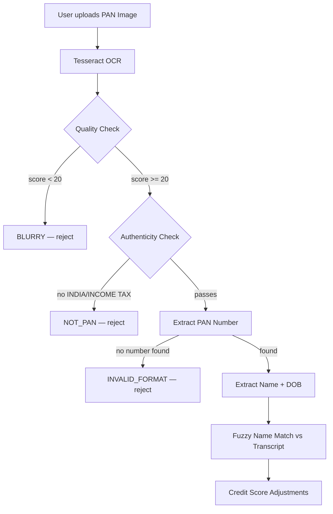

# 🪪 PAN Card Integration Guide

## Way 1 — Testing Mode (Fake PAN Card)

Use the generated test card to test the complete loan flow without a real PAN card.

### Download / Use Test Card
The test card is available at:
**`/public/test_pan_card.png`** (served at `http://localhost:5173/test_pan_card.png`)


### Test Card Details
| Field | Value |
|-------|-------|
| **PAN Number** | `TESTPAN1234A` |
| **Name on PAN** | `SWAPNIL TESTUSER` |
| **Date of Birth** | `01/01/1990` |
| **Father's Name** | `RAMESH TESTUSER` |

### How to Test
1. Start Video KYC
2. During the interview, say your name as **"Swapnil Testuser"** to get a name match bonus
3. On the PAN upload step, upload the `test_pan_card.png` file
4. The system **auto-detects** the test card (by the `TESTPAN1234A` marker) and bypasses real OCR
5. You will receive **+150 credit score bonus** (80 PAN verified + 20 quality + 50 name match)

> [!TIP]
> To test a **name mismatch**, say a different name during the interview (e.g., "Rahul Sharma") — you will see a -80 penalty and a rejection reason.

---

## Way 2 — Real World Integration

### Full Pipeline



### Credit Score Adjustments from PAN

| Factor | Condition | Score Δ |
|--------|-----------|---------|
| PAN number extracted | Valid AAAAA9999A format | **+80** |
| Image Quality: Excellent | OCR confidence ≥ 70 | **+20** |
| Image Quality: Good | OCR confidence 50–69 | 0 |
| Image Quality: Low | OCR confidence 30–49 | **-40** |
| Image Quality: Very Poor / Blurry | OCR confidence < 30 | **-80** |
| Name Match: Exact (≥85%) | Names match | **+50** |
| Name Match: Partial (65–84%) | Names mostly match | **+20** |
| Name Match: Weak (40–64%) | Names partially differ | **-30** |
| Name Match: Mismatch (<40%) | Names don't match | **-80** |
| Name unreadable from PAN | OCR couldn't extract name | **-15** |

### Real-World Rejection Reasons Generated
- `BLURRY` — image too dark, blurry, or low resolution
- `NOT_PAN` — wrong document uploaded (no govt. keywords)
- `FAKE_DETECTED` — contains markers like "sample", "dummy", "specimen"
- `PDF_NOT_SUPPORTED` — user uploaded PDF instead of image
- `INVALID_FORMAT` — govt. keywords present but no valid PAN number found
- `NAME_MISMATCH` — fuzzy match < 40% between PAN name and spoken name

### Name Matching Algorithm
Uses **Levenshtein edit distance** with normalisation:
```
similarity = (1 - editDistance / maxLength) × 100
```

Both strings are lowercased and stripped of punctuation before comparison. This handles:
- Case differences: `SWAPNIL` vs `swapnil` ✅
- Minor spelling: `Swapneel` vs `Swapnil` (~80% match) ✅  
- Father's name confusion: `Swapnil Ramesh` vs `Swapnil` (~70% match) ✅
- Completely different names: `Rahul Sharma` vs `Swapnil` (~5% → mismatch) ❌

---

## Testing Scenarios

| Scenario | PAN Upload | Spoken Name | Expected Result |
|----------|-----------|-------------|-----------------|
| ✅ Perfect | `test_pan_card.png` | "Swapnil Testuser" | +150 pts |
| ✅ Partial match | `test_pan_card.png` | "Swapnil" | +80 + 20 pts |
| ❌ Name mismatch | `test_pan_card.png` | "Rahul Sharma" | -80 pts + rejection reason |
| ❌ Blurry image | Dark/blurred photo | Any | -80 pts + rejection |
| ❌ No PAN | Skip upload | Any | Base score = 300 |
| ❌ Wrong doc | Upload ID card / selfie | Any | NOT_PAN rejection |
